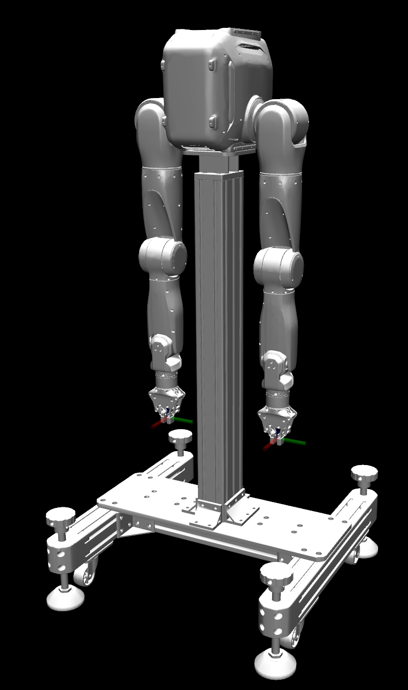
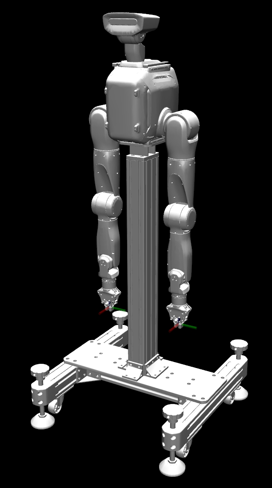
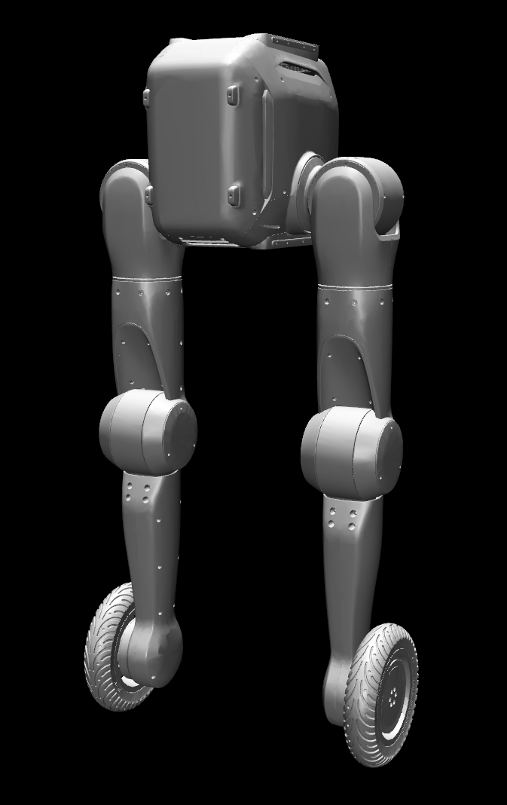
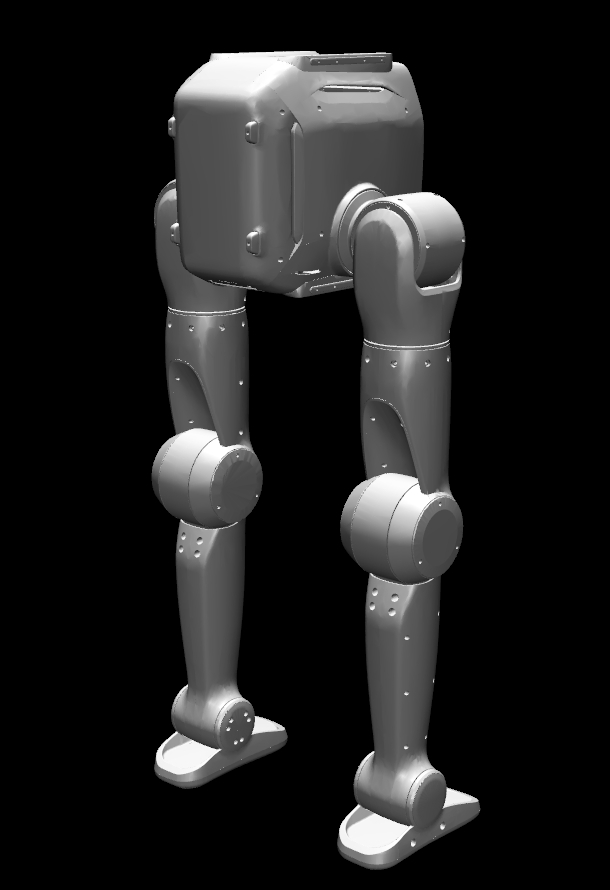
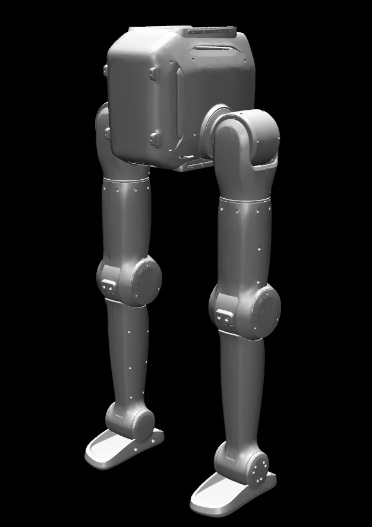
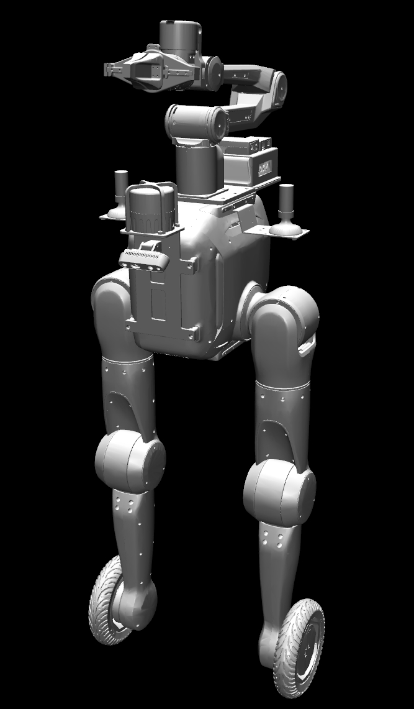
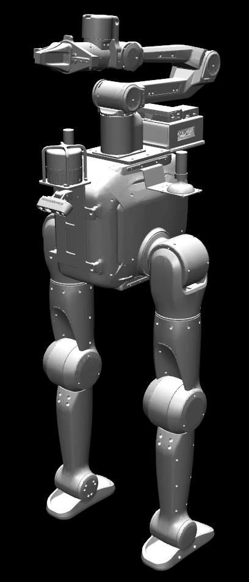
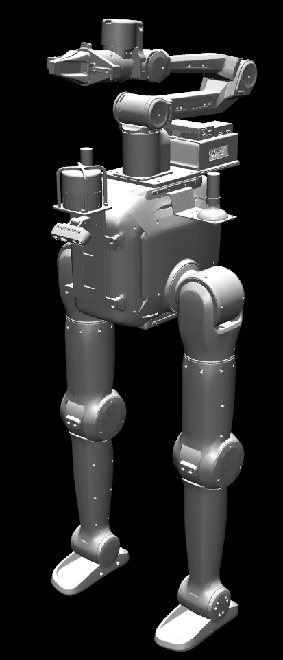

# TRON2 robot description

URDF / xacro, MuJoCo XML, meshes, and optional USD assets for **TRON2A** robot variants. This package is intended for simulation, visualization, and downstream tooling (ROS 1/2, MuJoCo, Isaac Sim, and similar).

## License

This project is licensed under the **Apache License, Version 2.0** (January 2004). See the [`LICENSE`](LICENSE) file for the full text.

SPDX identifier: `Apache-2.0`.

## Repository layout

Each hardware/software configuration lives under `tron2/<VARIANT>/`:

| Path | Contents |
|------|-----------|
| `urdf/` | Generated or hand-maintained URDF |
| `xacro/` | Source xacro (macro includes, collision options) |
| `xml/` | MuJoCo model (`robot.xml`) |
| `meshes/` | STL meshes referenced by the models |
| `usd/` | USD assets (present on some variants) |

Illustrations for each variant are in [`docs/images/`](docs/images/) and are embedded in the [Models](#models) section below.

---

## Joint zero convention

- **Revolute / prismatic joints:** In these models, **zero angle or zero displacement** is the joint value where the exported URDF/MuJoCo joint axis definition matches the neutral mesh pose at rest. Use this as the software zero for controllers and simulators.
- **Floating base:** The base is **floating** in the world (six degrees of freedom: position + orientation). MuJoCo often uses a **free joint** on the root; URDF uses a **floating** base joint where applicable. Use **`base_Link`** / the documented root link for transforms; world pose comes from simulation or your localization stack.
- **Calibration:** Before shipment, each robot is **factory-calibrated** so joint zeros match the **standard zeros defined in this repository’s URDF**. Normal operation assumes that alignment; refer to maintenance procedures only after hardware service or major assembly changes.

Coordinate conventions follow typical ROS usage unless stated otherwise in your integration stack: **x** forward, **y** left, **z** up from the root link.

- **SF / SFYG leg morphology:** The URDF/MuJoCo **zero** pose is not always the posture used on the real robot for walking control. See [SF_TRON2A](#sf_tron2a) for **zero vs knees-forward** (knees facing forward) and the proximal-yaw 180° convention.

---

## Variant overview

| Variant folder | Short description |
|----------------|-------------------|
| `DA_TRON2A` | Dual-arm manipulators with grippers; torso-mounted IMU frame. |
| `DACH_TRON2A` | Dual-arm configuration **with a 2-DoF head** (yaw / pitch). |
| `WF_TRON2A` | **Wheeled** leg design (knee + wheel); torso IMU. |
| `SF_TRON2A` | **Sole Ankle** leg design (no wheel); torso IMU. |
| `WFYG_TRON2A` | WF base plus **upper-body peripherals** (arms, grippers, mast-mounted structures). |
| `SFYG_TRON2A` | SF base plus the same **upper-body peripheral** stack as `WFYG_TRON2A`. |

The suffix **YG** denotes the richer upper-body / mast peripheral layout (arms, hands, and accessory links—see below).

---

## External sensors by variant

Summary of **torso-mounted and mast-mounted peripherals** as represented in this repository. **Gazebo** entries refer to plugins in the shipped URDF where present; **MuJoCo** models expose IMU-related sensors on the listed sites. Real hardware may include devices not modeled here. For **YG** variants, **Mast & auxiliary URDF (YG)** lists both model link names and on-robot hardware (all LiDAR / RTK / compute / arm-side payloads are mounted on the **arm transition bracket**, URDF link **`transition_Link`**).

| Variant | Torso IMU | RGB-D / depth (chest, D435-class) | Mast & auxiliary URDF (YG) | Notes |
|--------|-----------|-------------------------------------|------------------------------|--------|
| `DA_TRON2A` | Yes — link `base_imu` | Yes — `d435_Link` + `d435_optical_frame` (geometry only; no Gazebo depth plugin) | — | MuJoCo: quaternion / gyro / accelerometer at site `base_imu`. |
| `DACH_TRON2A` | Yes — link `base_imu` | Yes — `d435_Link` + `d435_optical_frame`; Gazebo depth camera plugin | — | Full URDF/xacro/XML/USD in this tree; 2-DoF head (`head_yaw` / `head_pitch`). MuJoCo IMU at site `base_imu`. |
| `WF_TRON2A` | Yes — link `base_imu`; Gazebo `base_imu_sensor` | Yes — `d435_Link` + `d435_optical_frame`; Gazebo depth camera plugin | — | |
| `SF_TRON2A` | Yes — same pattern as WF | Yes — same D435 Gazebo block as WF | — | |
| `WFYG_TRON2A` | Yes | Yes — same chest D435 as WF | **URDF (meshes / kinematics):** `transition_Link` (转接件), `camera_mount_Link`, `radar_Link`, `antenna_L_Link`, `antenna_R_Link`. **Physical hardware** (on `transition_Link`): LiDAR **RoboSense Fairy96** (速腾 Fairy96); dual arms **AgileX Piper X** (松灵 PiperX); RTK **Huace M722** (华测 M722); compute **NVIDIA Jetson Orin NX**. **Simulation note:** URDF provides geometry/collision only; **no** Gazebo radar/RF sensor plugins in this package. | |
| `SFYG_TRON2A` | Yes | Yes | **Same YG stack as `WFYG_TRON2A`** — same URDF link set, same hardware (Fairy96, Piper X, M722, Orin NX on `transition_Link`) and the same simulation caveats. |  |

**Legend:** “RGB-D / depth” follows the Intel RealSense **D435**-style optical frame and Gazebo `depth` sensor naming (`d435_camera_sensor`) where present. Add your own drivers or Gazebo plugins if you need simulated radar or extra cameras.

---

## Models

### DA_TRON2A

- **Summary:** Biped with **dual arms** and **parallel grippers**; suitable for manipulation-focused simulation and control development.
- **Root / IMU:** URDF exposes link `base_imu` fixed to `base_Link` at the torso IMU origin. MuJoCo uses site `base_imu` on the floating root with quaternion, gyro, and accelerometer sensors.
- **End effectors:** Left / right arms terminate in parallel-gripper links `grasper_L_Link` / `grasper_R_Link` (fixed in the default `robot.urdf`). A chest-mounted RealSense **D435** is modeled as `d435_Link` + `d435_optical_frame`.
- **Typical paths:** `tron2/DA_TRON2A/urdf/robot.urdf`, `tron2/DA_TRON2A/xml/robot.xml`.

### DACH_TRON2A

- **Summary:** Same dual-arm stack as **DA**, plus a **2-DoF head** (`head_yaw_Joint`, `head_pitch_Joint`) for perception.
- **Root / IMU:** Same IMU modeling pattern as DA (URDF link `base_imu`; MuJoCo site `base_imu` with orientation / gyro / accel sensors).
- **Typical paths:** `tron2/DACH_TRON2A/urdf/robot.urdf`, `tron2/DACH_TRON2A/xml/robot.xml` (USD under `tron2/DACH_TRON2A/usd/`; meshes under `tron2/DACH_TRON2A/meshes/`).

### WF_TRON2A

- **Summary:** Locomotion-oriented variant with **powered wheels** at the ankles (`wheel_L_Link` / `wheel_R_Link`) and knee joints (`knee_*`).
- **Root / IMU:** URDF link `base_imu` fixed to `base_Link`; MuJoCo exposes `base_imu` sensors (orientation, gyro, accelerometer) tied to that site.
- **Typical paths:** `tron2/WF_TRON2A/urdf/robot.urdf`, `tron2/WF_TRON2A/xml/robot.xml`.

### SF_TRON2A

- **Summary:** Leg design with **ankle pitch** links instead of wheels; otherwise shares the same leg topology style as WF at the hip/knee level.
- **Root / IMU:** Same `base_imu` / MuJoCo sensor layout as **WF_TRON2A**.
- **Zero position vs control (knees-forward):** The mesh/URDF **zero** matches the standing pose in the left figure. For whole-body control we usually want **knees-forward** orientation—the knees point forward (human-like stance). In software, that layout is obtained by rotating each leg’s **hip yaw** joint by **180°** (π rad), e.g. `proximal_yaw_L_Joint` and `proximal_yaw_R_Joint`, as shown on the right. The model file still encodes the nominal zero; apply the offset in your controller or state initialisation as needed.

| Zero position (nominal kinematic zero) | Knees-forward pose for control (after ~180° yaw per leg) |
| --- | --- |
|  |  |

- **Typical paths:** `tron2/SF_TRON2A/urdf/robot.urdf`, `tron2/SF_TRON2A/xml/robot.xml`.

### WFYG_TRON2A (for ATEC)

- **Summary:** **WF** locomotion base plus **dual arms**, grippers, and **mast-mounted accessory geometry**: `camera_mount_Link`, nested `radar_Link`, and paired `antenna_*` links (visual/collision meshes for integration with perception stacks).
- **Root / IMU:** Same torso IMU pattern as WF (`base_imu` in URDF; MuJoCo IMU sensors on `base_imu`).
- **Hardware / mast:** Physical LiDAR, arms, RTK, compute, and mount frames are listed in [External sensors by variant](#external-sensors-by-variant); URDF uses meshes/links only unless Gazebo plugins are added locally.
- **Manipulation frame:** A fixed `gripper_pick` body in the MuJoCo model (`xml/robot.xml`) marks the gripper pick point for grasp planning.
- **Typical paths:** `tron2/WFYG_TRON2A/urdf/robot.urdf`, `tron2/WFYG_TRON2A/xml/robot.xml`.

### SFYG_TRON2A (for ATEC)

- **Summary:** **SF** ankle-pitch legs with the same **YG** upper-body and mast peripheral layout as `WFYG_TRON2A`.
- **Legs vs SF:** The **same zero-position and knees-forward convention** as **SF_TRON2A** applies: nominal mesh zero (left) vs **knees-forward** control pose via **180° hip yaw** per leg (right). The YG variant uses the figures below (same leg semantics as `SF_0` / `SF_1`, with arms and mast peripherals).

| Zero position (nominal kinematic zero) | Knees-forward pose for control (after ~180° yaw per leg) |
| --- | --- |
|  |  |

- **Root / IMU:** Same as SF/WF YG variants (`base_imu` / MuJoCo IMU block).
- **Hardware / mast:** Same as WFYG — see [External sensors by variant](#external-sensors-by-variant).
- **Manipulation frame:** Same `gripper_pick` pick-point body as WFYG in the MuJoCo model (`xml/robot.xml`).
- **Typical paths:** `tron2/SFYG_TRON2A/urdf/robot.urdf`, `tron2/SFYG_TRON2A/xml/robot.xml`.

---

## ROS packages

The catkin / colcon package manifest is [`package.xml`](package.xml). Install the `tron2` tree into your workspace share directory via the provided `CMakeLists.txt` when building under ROS 1 or ROS 2.

---
